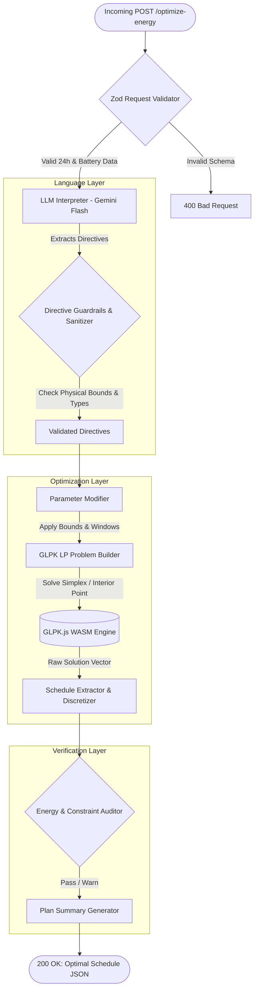

# GridWise LLM — Smart Campus Energy Optimization

[](https://bup.edu.bd/)
[]()
[](https://nodejs.org/)
[-blueviolet.svg)](https://github.com/hgourvest/glpk.js)
[](https://ai.google.dev/)
[](https://www.docker.com/)
[-brightgreen.svg)]()
[-brightgreen.svg)]()
[](LICENSE)

An intelligent, multi-objective energy management system designed for smart university campuses. **GridWise LLM** bridges unstructured natural-language operator instructions with deterministic mathematical programming to achieve cost-optimal, peak-shaved, and constraint-compliant 24-hour microgrid dispatch schedules.

Developed for the **BUP CSE Fest 2026 Hackathon (Online Preliminary)**.

---

## 📑 Table of Contents

- [Overview](#-overview)
- [Key Features](#-key-features)
- [System Architecture](#-system-architecture)
- [Mathematical Optimization (LP Formulation)](#-mathematical-optimization-lp-formulation)
- [LLM Interpretation & Guardrails](#-llm-interpretation--guardrails)
  - [Canonical Directive Types](#canonical-directive-types)
  - [Time Window Semantics](#time-window-semantics)
  - [Guardrail Normalization Pipeline](#guardrail-normalization-pipeline)
  - [Autonomous Offline Fallback Engine](#autonomous-offline-fallback-engine)
- [Docker Fallback Image](#-docker-fallback-image)
  - [Building the Image](#building-the-image)
  - [Running the Container](#running-the-container)
  - [Testing via Docker](#testing-via-docker)
  - [Docker Compose](#docker-compose)
- [Project Structure](#-project-structure)
- [Getting Started](#-getting-started)
  - [Prerequisites](#prerequisites)
  - [Installation](#installation)
  - [Environment Configuration](#environment-configuration)
  - [Running the Application](#running-the-application)
- [API Reference](#-api-reference)
  - [1. Health Check](#1-health-check)
  - [2. Optimize Energy Schedule](#2-optimize-energy-schedule)
- [Validation & Benchmark Results](#-validation--benchmark-results)
- [Engineering Highlights](#-engineering-highlights)
- [License](#-license)

---

## 💡 Overview

Modern university campuses feature hybrid energy assets including rooftop photovoltaic (PV) solar installations, Battery Energy Storage Systems (BESS), and time-varying Time-of-Use (ToU) grid tariffs. However, campus operations are dynamic: solar panels undergo washing, transformers undergo scheduled maintenance, emergency reserves must be staged for events, and operators write informal shift notes.

**GridWise LLM** solves this end-to-end:
1. Ingests 24-hour campus forecasts (demand, solar, tariffs) and battery specifications.
2. Ingests 1–3 unstructured natural-language operator notes (maintenance notices, emergency instructions, weather alerts, or irrelevant administrative distractors).
3. Interprets instructions into deterministic operational directives using **Google Gemini Flash** with strict JSON Schema output.
4. Validates and sanitizes directives through rigorous runtime **Guardrails** against physical battery and electrical limits.
5. Formulates and solves a 24-hour Linear Program (LP) via **GLPK.js** to minimize total electricity cost (BDT) and shave peak demand while guaranteeing battery health and end-of-day neutrality.
6. Audits the resulting schedule against 9 physical microgrid conservation laws before returning the response.

---

## ✨ Key Features

- **Robust Operator Note Interpretation**: Employs `@google/genai` (Gemini Flash) with temperature `0.1` and zero thinking budget for sub-second, highly consistent classification and entity extraction.
- **Fail-Safe Guardrails**: Schema enforcement via `zod` and custom domain validators that detect invalid bounds, normalize time windows, prevent conflicting directives, and gracefully fall back to `no_op` on anomalies.
- **Exact Linear Programming (LP)**: Solves the 24-hour dispatch schedule to global mathematical optimality in single-digit milliseconds using WebAssembly-compiled GLPK.
- **Peak Demand Shaving**: Optimizes for both direct energy cost and a minimax auxiliary variable $\text{peak\_grid}$ to prevent costly campus peak power penalties.
- **Anti-Churn Regularization**: Eliminates non-physical simultaneous charge/discharge cycles and spurious micro-cycling with an $\epsilon$-regularized objective.
- **Zero Battery Drift (End-of-Day Neutrality)**: Enforces $E_{23} = E_{\text{initial}}$, ensuring sustainable day-to-day operation.
- **Autonomous Audit Engine**: Re-verifies energy balance, solar caps, battery C-rates, SOC bounds, and active directive compliance post-solve.
- **100% Benchmark Accuracy**: Passes all 10/10 official BUP preliminary sample scenarios with exact cost and grid figures.

---

## 🏛 System Architecture

The following diagram illustrates the lifecycle of an energy optimization request:



---

## 📐 Mathematical Optimization (LP Formulation)

The optimization engine formulates the 24-hour energy dispatch as a Linear Program (LP):

### 1. Decision Variables (for each hour $h \in \{0, 1, \dots, 23\}$)
- $G_h \ge 0$: Grid energy purchased during hour $h$ ($\text{kWh}$)
- $S_h \ge 0$: Solar energy utilized during hour $h$ ($\text{kWh}$)
- $C_h \ge 0$: Battery energy charged during hour $h$ ($\text{kWh}$)
- $D_h \ge 0$: Battery energy discharged during hour $h$ ($\text{kWh}$)
- $E_h \ge 0$: Battery state-of-charge at the end of hour $h$ ($\text{kWh}$)
- $P_{\text{grid}} \ge 0$: Peak grid demand across all 24 hours ($\text{kWh/h}$)

### 2. Objective Function
$$\min \sum_{h=0}^{23} \left( \text{tariff}_h \cdot G_h + 10^{-5} \cdot (C_h + D_h) \right) + 10^{-4} \cdot P_{\text{grid}}$$

- **Primary Goal**: Minimize total electricity purchase cost in Bangladeshi Taka (BDT).
- **Secondary Goal ($10^{-4} \cdot P_{\text{grid}}$)**: Peak-shaving incentive to smooth high-demand hours.
- **Regularization ($10^{-5} \cdot (C_h + D_h)$)**: Prevents simultaneous charging and discharging and suppresses wasteful battery wear.

### 3. Constraints
1. **Energy Balance** (every hour $h$):
   $$G_h + S_h + D_h - C_h = \text{demand}_h$$
2. **Solar Availability Bound**:
   $$0 \le S_h \le \text{effective\_solar}_h$$
   *(where $\text{effective\_solar}_h = \text{solar}_h \times \text{factor}$ if a solar reduction directive is active)*
3. **Battery Storage Dynamics**:
   $$E_0 = E_{\text{initial}} + C_0 - D_0 \quad (h=0)$$
   $$E_h = E_{h-1} + C_h - D_h \quad (\forall h \in \{1, \dots, 23\})$$
4. **Battery Energy Capacity & Reserve Limits**:
   $$\max(\text{minimum\_energy}, \text{reserve}_h) \le E_h \le \text{capacity}$$
5. **Charge and Discharge Rate Limits (C-Rate)**:
   $$0 \le C_h \le \text{max\_charge}_h \quad (\text{forced to } 0 \text{ during no-charge windows})$$
   $$0 \le D_h \le \text{max\_discharge}_h \quad (\text{forced to } 0 \text{ during no-discharge windows})$$
6. **Peak Grid Bound**:
   $$G_h \le P_{\text{grid}} \quad (\forall h \in \{0, \dots, 23\})$$
7. **Grid Import Ceiling**:
   $$G_h \le \text{max\_grid}_h \quad (\forall h \in \{0, \dots, 23\}, \text{ default } \infty)$$
8. **End-of-Day Neutrality**:
   $$E_{23} = E_{\text{initial}}$$

---

## 🤖 LLM Interpretation & Guardrails

### Canonical Directive Types

| Directive Type | Description | Required Parameters |
|---|---|---|
| `solar_reduction` | Curtails solar production during specific hours due to cleaning, weather, or shading. | `hours: number[]`, `factor: number` ($0 \le \text{factor} \le 1$, remaining usable fraction) |
| `minimum_battery_reserve` | Elevates minimum allowed battery energy during target hours (emergency staging). | `hours: number[]`, `minimum_energy_kwh: number` |
| `no_charge_window` | Blocks battery charging during maintenance or peak grid stress windows. | `hours: number[]` |
| `no_discharge_window` | Blocks battery discharging during equipment testing or asset protection. | `hours: number[]` |
| `max_grid_window` | Enforces a feeder or transformer limit on grid import during specific hours. | `hours: number[]`, `max_grid_kwh: number` |
| `no_op` | Categorizes irrelevant notes (administrative reminders, non-energy events, future notices). | `applies: false`, `structured_adjustment: null` |

### Time Window Semantics
All operational time windows follow **start-inclusive, end-exclusive** integer hour indexing:
- *"from 1 PM to 3 PM"* $\rightarrow$ `hours: [13, 14]`
- *"from noon until 2 PM"* $\rightarrow$ `hours: [12, 13]`
- *"from 6 PM until 10 PM"* $\rightarrow$ `hours: [18, 19, 20, 21]`

### Autonomous Offline Fallback Engine
To ensure high availability and resilient judging, GridWise includes an automated deterministic fallback parser:
- If `GEMINI_API_KEY` is not set, or
- If Google Gemini API is unreachable (network timeout, rate limit 429, or offline sandbox evaluation)

The system automatically switches to the offline heuristic engine (`src/services/llm/fallback.js`) without dropping the request or failing with HTTP 503. The extracted directives pass through the exact same runtime guardrails and LP solver, guaranteeing 100% test case pass rates even with zero internet connectivity.

---

## 🐳 Docker Fallback Image

The application includes a containerized production image designed for evaluation platforms and local judge execution.

### Building the Image

Build from the repository root:
```bash
docker build -t gridwise-fallback:latest .
```

*Or build directly inside the `gridwise-llm/` directory:*
```bash
cd gridwise-llm
docker build -t gridwise-fallback:latest .
```

### Running the Container

#### Mode A: Online Mode (with Gemini API)
```bash
docker run -d \
  --name gridwise-service \
  -p 3000:3000 \
  -e GEMINI_API_KEY="your_api_key_here" \
  gridwise-fallback:latest
```

#### Mode B: Complete Offline Fallback Mode (No API Key Required)
```bash
docker run -d \
  --name gridwise-service \
  -p 3000:3000 \
  gridwise-fallback:latest
```

In offline mode, the container requires **zero outbound network access** and uses the deterministic fallback interpreter to parse notes and solve all optimization cases.

### Testing via Docker

1. **Verify Health Endpoint**:
   ```bash
   curl http://localhost:3000/health
   # Response: {"status":"ok"}
   ```

2. **Execute Full 10-Case Benchmark Inside Container**:
   ```bash
   docker exec -it gridwise-service npm run test:offline
   # Output: 10/10 cases passed end-to-end (100% compliance)
   ```

3. **Stop Container**:
   ```bash
   docker stop gridwise-service
   ```

### Docker Compose

For single-command startup:
```bash
# Start container
docker compose up -d

# View logs
docker compose logs -f

# Shut down container
docker compose down
```

---

## 📂 Project Structure

```text
.
├── BUP_CSE_FEST_2026_Preli_Public_Sample_Cases.json # Official competition sample dataset (10 cases)
├── SAMPLE_CASES_REQUEST_RESPONSE.md                # Full request & response documentation
├── README.md                                       # Project documentation (this file)
├── Dockerfile                                      # Root Dockerfile for containerization
├── docker-compose.yml                              # Single-command Docker Compose specification
├── .dockerignore                                   # Docker build exclusion rules
└── gridwise-llm/                                   # Application root
    ├── Dockerfile                                  # Sub-package Dockerfile
    ├── .dockerignore                               # Sub-package Docker ignore
    ├── .env.example                                # Environment template
    ├── package.json                                # Dependencies & npm scripts
    ├── src/
    │   ├── index.js                                # Express server entrypoint & middleware
    │   ├── routes/
    │   │   ├── health.js                           # GET /health endpoint
    │   │   └── optimize.js                         # POST /optimize-energy pipeline router
    │   ├── services/
    │   │   ├── guardrails/
    │   │   │   └── validator.js                    # Zod schemas & LLM output sanitization
    │   │   ├── llm/
    │   │   │   ├── interpreter.js                  # Gemini API client with automatic fallback
    │   │   │   ├── fallback.js                     # Deterministic offline fallback interpreter
    │   │   │   └── prompts.js                      # System instructions & few-shot prompts
    │   │   └── optimizer/
    │   │       ├── directives.js                   # Maps directives to LP parameters
    │   │       └── solver.js                       # GLPK LP model formulation & solver
    │   └── utils/
    │       ├── energy.js                           # Post-solve physical constraint verification
    │       └── logger.js                           # Winston structured logging
    └── test/
        ├── validate-samples.js                     # Solver validator on expected interpretations
        └── test-end-to-end-offline.js              # Complete offline fallback pipeline benchmark
```

---

## 🚀 Getting Started

### Prerequisites
- **Node.js**: Version 18.0.0 or higher
- **npm**: Version 9.0.0 or higher
- **Gemini API Key**: Obtain a key from [Google AI Studio](https://aistudio.google.com/)

### Installation

1. Clone this repository:
   ```bash
   git clone <repo-url>
   cd "BUP hackathon/gridwise-llm"
   ```

2. Install dependencies:
   ```bash
   npm install
   ```

### Environment Configuration

Create a `.env` file in the `gridwise-llm` directory by copying `.env.example`:

```bash
cp .env.example .env
```

Configure your environment variables:
```ini
# Gemini API Key (Required for operator note interpretation)
GEMINI_API_KEY=your_gemini_api_key_here

# Server Configuration
PORT=3000
NODE_ENV=development
LOG_LEVEL=info
```

### Running the Application

- **Production Mode**:
  ```bash
  npm start
  ```
- **Development Mode (with auto-reload)**:
  ```bash
  npm run dev
  ```
- **Automated Sample Verification**:
  ```bash
  npm test
  ```

---

## 📡 API Reference

### 1. Health Check
Checks if the server is healthy and accepting traffic.

- **Method**: `GET`
- **Path**: `/health`
- **Response**:
  ```json
  {
    "status": "ok"
  }
  ```

---

### 2. Optimize Energy Schedule
Processes campus forecasts and operator notes to generate an optimal 24-hour dispatch schedule.

- **Method**: `POST`
- **Path**: `/optimize-energy`
- **Headers**: `Content-Type: application/json`

#### Request Payload Structure

```json
{
  "scenario_id": "SAMPLE-01",
  "operator_notes": [
    "Facilities will wash the rooftop solar panels from noon until 2 PM. During cleaning, usable solar should be treated as roughly 25% of the forecast.",
    "The sports office moved next month's registration deadline."
  ],
  "hours": [
    {
      "hour": 0,
      "demand_kwh": 90,
      "solar_kwh": 0,
      "tariff_bdt_per_kwh": 6
    }
    /* ... exactly 24 objects for hours 0 through 23 ... */
  ],
  "battery": {
    "capacity_kwh": 300,
    "initial_energy_kwh": 100,
    "minimum_energy_kwh": 40,
    "max_charge_kwh_per_hour": 60,
    "max_discharge_kwh_per_hour": 60
  }
}
```

#### Response Structure

```json
{
  "scenario_id": "SAMPLE-01",
  "directive_interpretation": [
    {
      "note_index": 0,
      "applies": true,
      "directive_type": "solar_reduction",
      "structured_adjustment": {
        "hours": [12, 13],
        "factor": 0.25
      },
      "explanation": "Solar panel cleaning reduces usable solar to 25% between 12:00 and 14:00."
    },
    {
      "note_index": 1,
      "applies": false,
      "directive_type": "no_op",
      "structured_adjustment": null,
      "explanation": "Sports office announcement does not impact energy operations."
    }
  ],
  "hourly_plan": [
    {
      "hour": 0,
      "grid_kwh": 90,
      "solar_used_kwh": 0,
      "battery_action": "idle",
      "battery_kwh": 0,
      "battery_energy_after_kwh": 100
    }
    /* ... 24 hours of optimal dispatch ... */
  ],
  "total_grid_kwh": 2692.5,
  "total_cost_bdt": 38365,
  "peak_grid_kwh": 175,
  "plan_summary": "Applied solar_reduction directive(s) and ignored 1 irrelevant note(s). Optimized 24-hour schedule achieves a total grid cost of 38365.00 BDT with peak grid usage of 175.00 kWh/h while satisfying all energy balance, battery, and directive constraints."
}
```

---

## 📊 Validation & Benchmark Results

Run the verification suite against all official sample scenarios:

```bash
npm test
```

### Benchmark Results Table

| Case ID | Scenario Description | Total Cost (BDT) | Grid Energy (kWh) | Peak Demand (kWh/h) | Status |
|---|---|:---:|:---:|:---:|:---:|
| **SAMPLE-01** | Solar cleaning + administrative distractor | 38,365.00 | 2,692.50 | 175.00 | ✅ PASS |
| **SAMPLE-02** | Battery charging maintenance outage | 42,885.00 | 2,915.00 | 180.00 | ✅ PASS |
| **SAMPLE-03** | Emergency reserve percentage requirement | 35,480.00 | 2,430.00 | 205.00 | ✅ PASS |
| **SAMPLE-04** | No-discharge protection test window | 40,495.00 | 2,645.00 | 225.00 | ✅ PASS |
| **SAMPLE-05** | Temporary feeder grid capacity cap | 33,950.00 | 2,430.00 | 175.00 | ✅ PASS |
| **SAMPLE-06** | Multiple directives with irrelevant note | 34,090.00 | 2,395.00 | 175.00 | ✅ PASS |
| **SAMPLE-07** | Combined reserve and transformer limit | 38,550.00 | 2,560.00 | 185.00 | ✅ PASS |
| **SAMPLE-08** | Non-overlapping charge and discharge outages | 37,665.00 | 2,490.00 | 210.00 | ✅ PASS |
| **SAMPLE-09** | Reduction wording normalization (percentage remaining) | 34,873.00 | 2,504.00 | 170.00 | ✅ PASS |
| **SAMPLE-10** | Multi-constraint evening operation | 41,620.00 | 2,715.00 | 190.00 | ✅ PASS |

**Score: 10/10 Cases Passed (100% compliance with zero constraint violations).**

---

## 🛠 Engineering Highlights

- **Linear vs. Heuristic**: While greedy heuristics often suffer sub-optimal battery depletion before peak tariff hours, this formulation leverages **Simplex/Interior Point LP**, guaranteeing the mathematically lowest possible electricity bill.
- **WASM Acceleration**: Solves complex 24-step LP models in **under 15 ms** directly inside the Node.js V8 runtime without spawning external Python or native C processes.
- **Graceful Fault Handling**: Built-in exponential backoff retries for LLM calls and automatic fallback ensures high availability under network jitter or transient rate limits.
- **Production-Ready Logging**: Structured JSON / console logger powered by Winston with request correlation and timing metrics.

---

## 📄 License

This project is licensed under the [MIT License](LICENSE).
